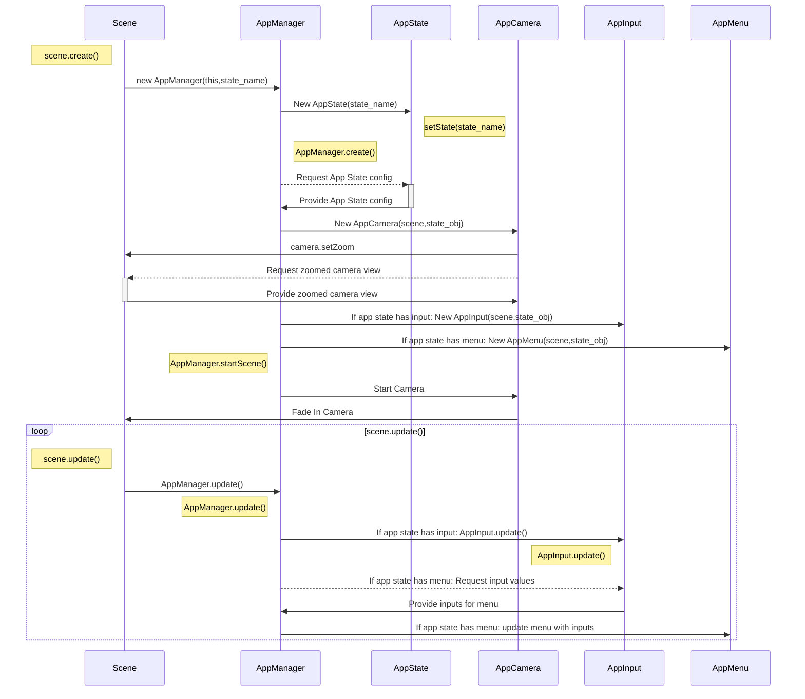

```mermaid
sequenceDiagram
Note left of Scene: scene.create()
Scene->> AppManager: new AppManager(this,state_name)
AppManager->> AppState: New AppState(state_name)
Note right of AppState: setState(state_name)
Note right of AppManager: AppManager.create()
AppManager-->>+ AppState: Request App State config
AppState->>- AppManager: Provide App State config
AppManager->> AppCamera: New AppCamera(scene,state_obj)
AppCamera->> Scene: camera.setZoom
AppCamera-->>+ Scene: Request zoomed camera view
Scene->>- AppCamera: Provide zoomed camera view
AppManager->> AppInput: If app state has input: New AppInput(scene,state_obj)
AppManager->> AppMenu: If app state has menu: New AppMenu(scene,state_obj)

Note left of AppManager: AppManager.startScene()
AppManager->> AppCamera: Start Camera
AppCamera->> Scene: Fade In Camera
loop scene.update()
	Note left of Scene: scene.update()
	Scene->> AppManager: AppManager.update()
	Note left of AppManager: AppManager.update()
	AppManager->> AppInput: If app state has input: AppInput.update()
	Note left of AppInput: AppInput.update()
	AppManager-->> AppInput: If app state has menu: Request input values
	AppInput->> AppManager: Provide inputs for menu
	AppManager->> AppMenu: If app state has menu: update menu with inputs
end
```
