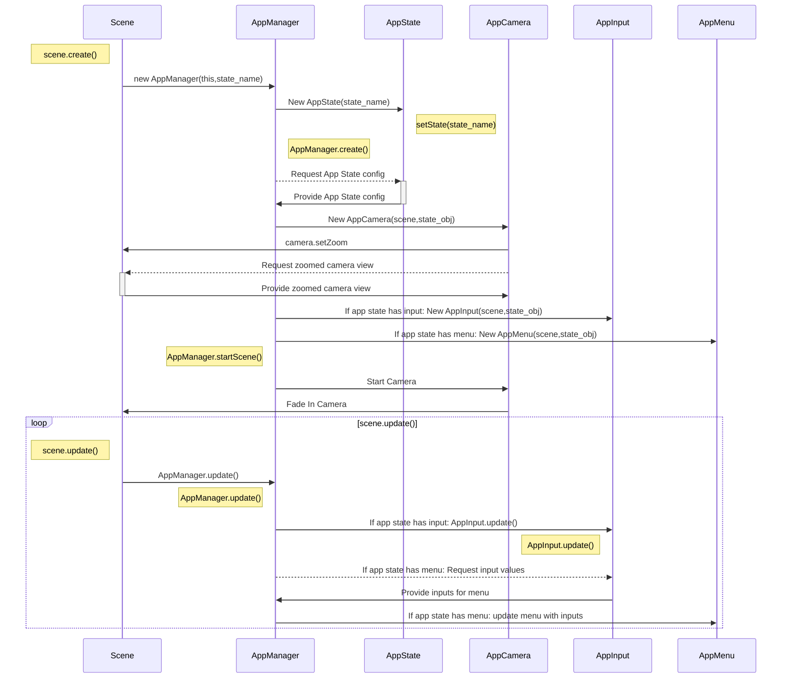
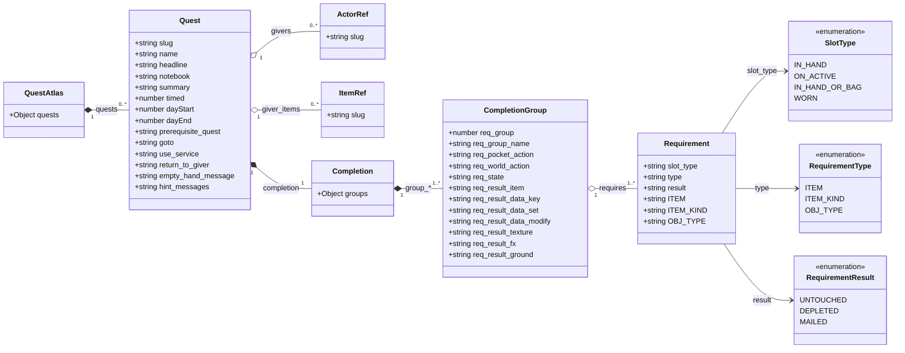

```mermaid
sequenceDiagram
Note left of Scene: scene.create()
Scene->> AppManager: new AppManager(this,state_name)
AppManager->> AppState: New AppState(state_name)
Note right of AppState: setState(state_name)
Note right of AppManager: AppManager.create()
AppManager-->>+ AppState: Request App State config
AppState->>- AppManager: Provide App State config
AppManager->> AppCamera: New AppCamera(scene,state_obj)
AppCamera->> Scene: camera.setZoom
AppCamera-->>+ Scene: Request zoomed camera view
Scene->>- AppCamera: Provide zoomed camera view
AppManager->> AppInput: If app state has input: New AppInput(scene,state_obj)
AppManager->> AppMenu: If app state has menu: New AppMenu(scene,state_obj)

Note left of AppManager: AppManager.startScene()
AppManager->> AppCamera: Start Camera
AppCamera->> Scene: Fade In Camera
loop scene.update()
	Note left of Scene: scene.update()
	Scene->> AppManager: AppManager.update()
	Note left of AppManager: AppManager.update()
	AppManager->> AppInput: If app state has input: AppInput.update()
	Note left of AppInput: AppInput.update()
	AppManager-->> AppInput: If app state has menu: Request input values
	AppInput->> AppManager: Provide inputs for menu
	AppManager->> AppMenu: If app state has menu: update menu with inputs
end
```

```mermaid
classDiagram
    direction LR

    class QuestAtlas {
        +Object quests
    }

    class Quest {
        +string slug
        +string name
        +string headline
        +string notebook
        +string summary
        +number timed
        +number dayStart
        +number dayEnd
        +string prerequisite_quest
        +string goto
        +string use_service
        +string return_to_giver
        +string empty_hand_message
        +string hint_messages
    }

    class ActorRef {
        +string slug
    }

    class ItemRef {
        +string slug
    }

    class Completion {
        +Object groups
    }

    class CompletionGroup {
        +number req_group
        +string req_group_name
        +string req_pocket_action
        +string req_world_action
        +string req_state
        +string req_result_item
        +string req_result_data_key
        +string req_result_data_set
        +string req_result_data_modify
        +string req_result_texture
        +string req_result_fx
        +string req_result_ground
    }

    class Requirement {
        +string slot_type
        +string type
        +string result
        +string ITEM
        +string ITEM_KIND
        +string OBJ_TYPE
    }

    class SlotType {
        <<enumeration>>
        IN_HAND
        ON_ACTIVE
        IN_HAND_OR_BAG
        WORN
    }

    class RequirementType {
        <<enumeration>>
        ITEM
        ITEM_KIND
        OBJ_TYPE
    }

    class RequirementResult {
        <<enumeration>>
        UNTOUCHED
        DEPLETED
        MAILED
    }

    QuestAtlas "1" *-- "0..*" Quest : quests
    Quest "1" o-- "0..*" ActorRef : givers
    Quest "1" o-- "0..*" ItemRef : giver_items
    Quest "1" *-- "1" Completion : completion
    Completion "1" *-- "1..*" CompletionGroup : group_*
    CompletionGroup "1" o-- "1..*" Requirement : requires

    Requirement --> SlotType : slot_type
    Requirement --> RequirementType : type
    Requirement --> RequirementResult : result
end
```